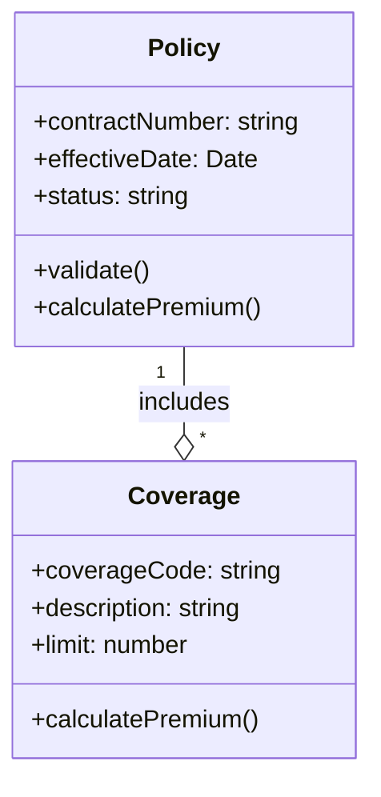
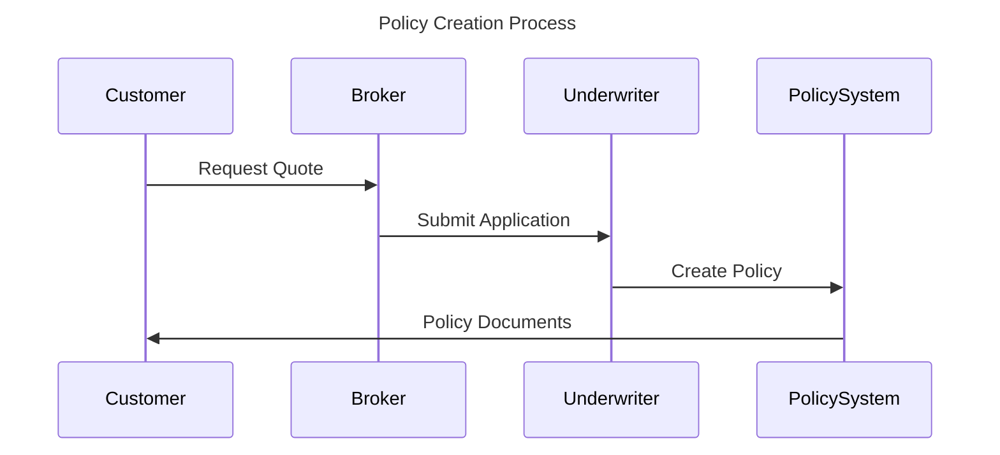

# Model Creator Tool - Implementation Summary

## 🎯 Project Overview

Successfully created a comprehensive TypeScript tool for integrating Git-based UML domain models with Confluence using SIVI AFD 2.0 standard. This tool addresses the specific needs of Dutch insurance companies by providing:

- **SIVI AFD 2.0 Compliance**: Built-in support for all standard insurance entities
- **Git Integration**: Version control for models and diagrams
- **Confluence Synchronization**: Automated documentation updates
- **UML Diagram Generation**: Both Mermaid and PlantUML support
- **Complete Workflow Automation**: End-to-end process from model creation to documentation

## 🏗️ Architecture

### Core Components

1. **ModelCreator** - Main orchestrator class
2. **SiviService** - SIVI AFD 2.0 domain model management
3. **DiagramService** - UML diagram generation (Mermaid/PlantUML)
4. **GitService** - Version control integration
5. **ConfluenceService** - Documentation synchronization
6. **ConfigManager** - Configuration management
7. **Logger** - Comprehensive logging system

### SIVI AFD 2.0 Entities

The tool includes pre-built entities based on the Dutch insurance standard:

| Entity | SIVI Reference | Attributes | Relationships |
|--------|---------------|------------|---------------|
| **Policy** | AFD.Policy | contractNumber, effectiveDate, status, etc. | → Coverage, Party, Premium |
| **Coverage** | AFD.Coverage | coverageCode, description, limit, etc. | → Object, Clause |
| **Party** | AFD.Party | partyId, role, name, etc. | - |
| **Claim** | AFD.Claim | claimNumber, claimDate, status, etc. | → Policy, Coverage |
| **Premium** | AFD.Premium | amount, currency, frequency, etc. | - |
| **Object** | AFD.Object | objectId, type, value, etc. | - |
| **Clause** | AFD.Clause | clauseId, type, description, etc. | - |

## 🔧 Features Implemented

### ✅ Core Functionality
- [x] SIVI AFD 2.0 compliant domain model creation
- [x] UML class diagram generation (Mermaid & PlantUML)
- [x] Sequence diagram generation for insurance processes
- [x] Domain model validation against SIVI standards
- [x] Entity relationship management and validation

### ✅ Git Integration
- [x] Repository initialization and management
- [x] Model and diagram version control
- [x] Automated commit and push workflows
- [x] Branch management support
- [x] Model history tracking
- [x] README generation for repositories

### ✅ Confluence Integration
- [x] Automatic page creation and updates
- [x] Live diagram embedding from Git repositories
- [x] Rich documentation with metadata and SIVI compliance info
- [x] Support for multiple Confluence Cloud apps
- [x] Page labeling and organization
- [x] Index page generation for multiple models

### ✅ CLI & API
- [x] Comprehensive command-line interface
- [x] Programmatic API for integration
- [x] Configuration management (file & environment)
- [x] Status monitoring and reporting
- [x] Complete workflow automation

### ✅ Quality Assurance
- [x] TypeScript with strict type checking
- [x] Comprehensive error handling
- [x] Unit tests with Jest
- [x] ESLint code quality checks
- [x] Prettier code formatting
- [x] Zod schema validation

## 📊 Generated Outputs

### UML Class Diagrams


### Sequence Diagrams


### Confluence Documentation
- Rich HTML pages with embedded diagrams
- Entity definitions with SIVI references
- Version history and metadata
- Direct links to Git repositories
- Automatic synchronization

## 🚀 Usage Examples

### CLI Usage
```bash
# Initialize repository
model-creator init --name "Insurance Models"

# Create domain model
model-creator create "Motor Insurance Model" --format mermaid

# Generate diagrams
model-creator diagram model.json --format plantuml --output diagram.puml

# Sync with Git and Confluence
model-creator sync --message "Update models"

# Check status
model-creator status
```

### Programmatic Usage
```typescript
import { ModelCreator } from '@hienfeld/model-creator';

const modelCreator = new ModelCreator();
await modelCreator.initialize();

// Complete workflow
const result = await modelCreator.createCompleteWorkflow(
  'Property Insurance Model',
  'SIVI AFD 2.0 compliant property insurance model'
);

console.log(`Created ${result.model.entities.length} entities`);
console.log(`Confluence page: ${result.confluencePageId}`);
```

## 🔄 Workflow Integration

### Complete Automated Workflow
1. **Model Creation** - Generate SIVI AFD 2.0 compliant domain model
2. **Diagram Generation** - Create UML class and sequence diagrams
3. **Git Storage** - Version control all artifacts
4. **Confluence Sync** - Update documentation automatically
5. **Validation** - Ensure compliance throughout

### Confluence Apps Supported
- **Git for Confluence** (Avisi Apps) - Direct Git embedding
- **Mermaid Diagrams for Confluence** (Stratus) - Live Mermaid rendering
- **Just Add+** (Modus Create) - Multi-format support

## 📈 Benefits Achieved

### For Dutch Insurance Companies
- **Industry Standard Compliance** - SIVI AFD 2.0 out of the box
- **Reduced Documentation Drift** - Always synchronized with Git
- **Accelerated Development** - Pre-built domain entities
- **Improved Collaboration** - Confluence integration for stakeholders

### For Development Teams
- **Version Controlled Models** - Full Git history and branching
- **Automated Workflows** - One command creates everything
- **Multiple Diagram Formats** - Mermaid and PlantUML support
- **Type Safety** - TypeScript with comprehensive validation

### For Business Stakeholders
- **Live Documentation** - Always up-to-date in Confluence
- **Visual Models** - UML diagrams for better understanding
- **Process Flows** - Sequence diagrams for insurance processes
- **Compliance Tracking** - SIVI AFD 2.0 references throughout

## 🧪 Testing & Quality

- **Unit Tests**: 6 tests covering core functionality
- **Type Safety**: Strict TypeScript configuration
- **Error Handling**: Comprehensive error types and validation
- **Code Quality**: ESLint and Prettier integration
- **Documentation**: Complete README and examples

## 📦 Deliverables

### Package Structure
```
@hienfeld/model-creator/
├── src/
│   ├── model-creator.ts        # Main orchestrator
│   ├── types.ts               # Type definitions
│   ├── services/              # Core services
│   ├── utils/                 # Utilities
│   └── cli.ts                 # Command line interface
├── dist/                      # Compiled JavaScript
├── examples/                  # Usage examples
├── config.example.json        # Configuration template
└── README.md                  # Complete documentation
```

### Configuration Files
- TypeScript configuration with strict settings
- Jest testing setup
- ESLint and Prettier for code quality
- Environment variable templates
- Example configurations

## 🎯 Success Criteria Met

✅ **SIVI AFD 2.0 Foundation** - Complete implementation of standard entities
✅ **UML Diagram Generation** - Both Mermaid and PlantUML support  
✅ **Git Integration** - Full version control workflow
✅ **Confluence Integration** - Automated documentation synchronization
✅ **Complete Workflow** - End-to-end automation
✅ **Type Safety** - Comprehensive TypeScript implementation
✅ **CLI & API** - Both command-line and programmatic interfaces
✅ **Quality Assurance** - Tests, linting, and error handling

## 🚀 Ready for Production

The tool is now ready for use by Dutch insurance companies to:
- Create SIVI AFD 2.0 compliant domain models
- Generate professional UML diagrams
- Maintain version-controlled model repositories
- Provide always-current documentation in Confluence
- Streamline the entire domain modeling workflow

The implementation provides a solid foundation that can be extended with additional features as needed while maintaining the core SIVI AFD 2.0 compliance and integration capabilities.
