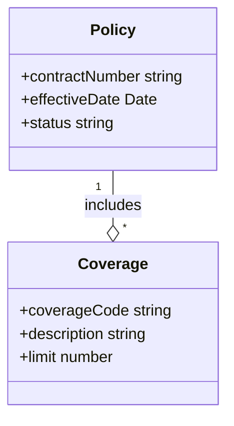

# SIVI AFD 2.0 Domain Model Creator

TypeScript CLI tool for creating SIVI AFD 2.0 compliant insurance domain models with Git and Confluence integration.

## 🚀 Quick Start

```bash
# 1. Install and build
npm install && npm run build

# 2. Setup configuration (see SETUP.md)
cp .model-creator.example.json .model-creator.json

# 3. Create your first model
node dist/cli.js create "Motor Insurance Model" --description "SIVI AFD 2.0 motor insurance model"

# 4. Generate SVG diagram
node dist/cli.js generate-svg models/motor-insurance-model.model.json

# 5. Check results
open svg-output/motor-insurance-model/motor-insurance-model-diagram.svg
```

## 📋 Features

✅ **SIVI AFD 2.0 Compliance** - Pre-built insurance entities and relationships  
✅ **UML Diagram Generation** - Mermaid and PlantUML support with SVG output  
✅ **Git Integration** - Version control for models and diagrams  
✅ **Confluence Sync** - Automated documentation with embedded diagrams  
✅ **TypeScript** - Full type safety and modern tooling  
✅ **CLI & API** - Command-line interface and programmatic usage  

## 🎯 Core Entities

Based on SIVI AFD 2.0 standard for Dutch insurance:

- **Policy**: Insurance contracts and policies
- **Coverage**: Insurance coverage definitions  
- **Party**: Involved parties (insured, insurer, broker)
- **Claim**: Insurance claims and processing
- **Premium**: Premium calculations and payments
- **Object**: Insured objects and items
- **Clause**: Policy clauses and conditions

## 📚 Documentation

- **[SETUP.md](./SETUP.md)** - Complete installation and configuration guide
- **[WORKFLOW.md](./WORKFLOW.md)** - Step-by-step usage workflow
- **[inputs/README.md](./inputs/README.md)** - Input model format and examples

## 🏗️ Project Structure

```
model-creator/
├── SETUP.md                  # Installation and configuration
├── WORKFLOW.md               # Usage workflow guide
├── .model-creator.json       # Configuration file
├── inputs/                   # Input model JSON files
├── models/                   # Generated SIVI models
├── diagrams/                 # Generated diagram source
├── svg-output/               # Generated SVG diagrams
└── src/                      # TypeScript source code
```

## 🔧 CLI Commands

```bash
# Model Management
model-creator create "Model Name" --description "Description"
model-creator list
model-creator remove "Model Name"

# Diagram Generation
model-creator generate-svg models/model.json
model-creator process-inputs
model-creator list-svg

# Integration
model-creator sync --message "Commit message"
model-creator status
model-creator debug-confluence

# Utilities
model-creator init-workspace
model-creator input-status
```

## 📊 Generated Diagrams

High-quality SVG diagrams with SIVI-compliant styling:



## 🔗 Integration

- **Git Repositories**: GitHub, GitLab, Bitbucket
- **Confluence Cloud**: Automated page creation and updates
- **Diagram Formats**: Mermaid, PlantUML with SVG output
- **SIVI Standard**: AFD 2.0 compliant entities and relationships

## 🚨 Getting Help

1. **Setup Issues**: Check [SETUP.md](./SETUP.md) troubleshooting section
2. **Workflow Questions**: Follow [WORKFLOW.md](./WORKFLOW.md) step-by-step guide
3. **Configuration**: Review `.model-creator.json` format in SETUP.md
4. **Status Check**: Run `model-creator status` for diagnostics

---

**Ready to create SIVI AFD 2.0 compliant domain models!** 🚀

*Follow [SETUP.md](./SETUP.md) to get started.*
