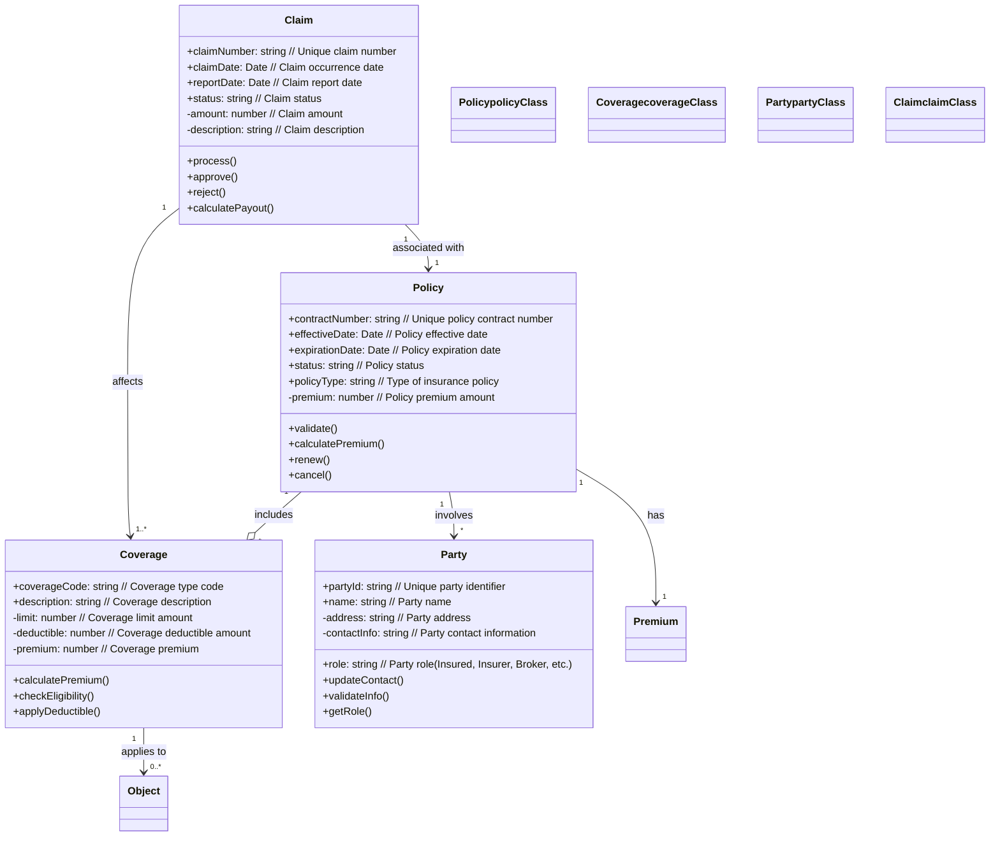
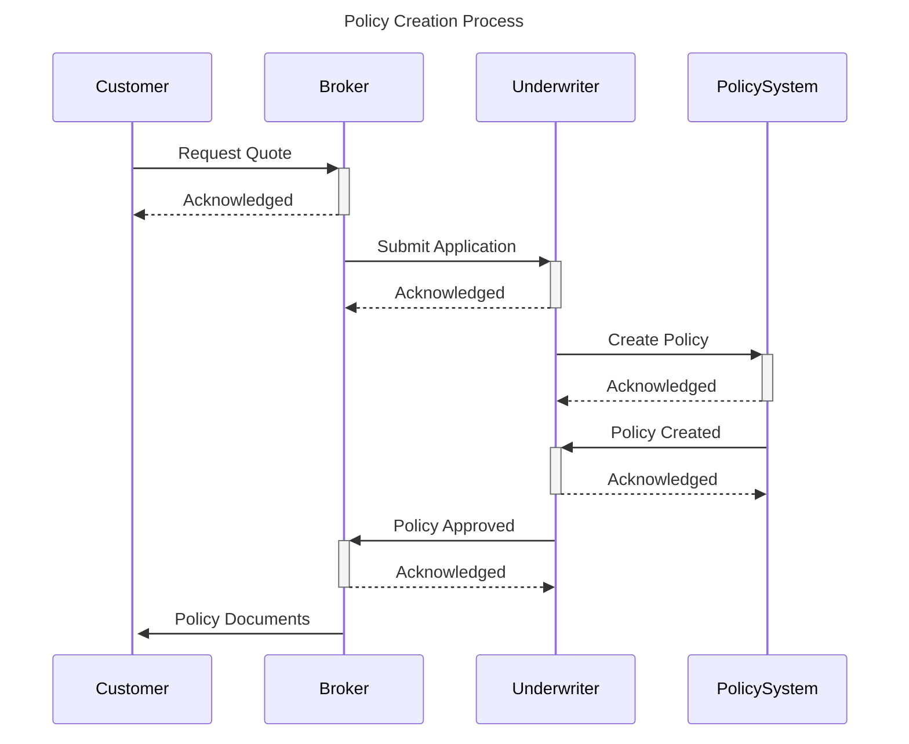
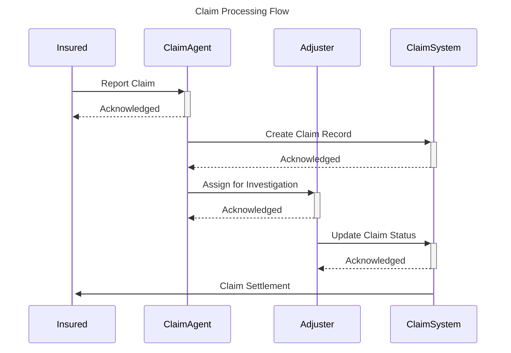

# Example Insurance Policy Domain Model

This example demonstrates a complete insurance policy domain model based on SIVI AFD 2.0.

## Generated Model Structure

```json
{
  "name": "Insurance Policy Domain Model",
  "version": "1.0.0",
  "description": "Complete insurance policy domain model based on SIVI AFD 2.0",
  "namespace": "nl.sivi.afd.insurance",
  "entities": [
    {
      "id": "policy",
      "name": "Policy",
      "type": "Policy",
      "description": "Insurance policy/contract entity",
      "attributes": [
        {
          "name": "contractNumber",
          "type": "string",
          "required": true,
          "description": "Unique policy contract number",
          "siviReference": "AFD.Policy.ContractNumber"
        },
        {
          "name": "effectiveDate",
          "type": "Date",
          "required": true,
          "description": "Policy effective date",
          "siviReference": "AFD.Policy.EffectiveDate"
        }
      ],
      "relationships": [
        {
          "type": "aggregation",
          "target": "Coverage",
          "cardinality": "1..*",
          "description": "Policy includes one or more coverages"
        }
      ],
      "siviReference": "AFD.Policy"
    }
  ]
}
```

## Generated Mermaid Diagram



## Generated PlantUML Diagram

```plantuml
@startuml
!theme plain

title Insurance Policy Domain Model - Domain Model
note top : Version 1.0.0\nBased on SIVI AFD 2.0\nGenerated: 2025-06-23T10:00:00.000Z

class Policy <<Policy>> {
  + contractNumber: string {Unique policy contract number}
  + effectiveDate: Date {Policy effective date}
  + expirationDate: Date {Policy expiration date}
  + status: string {Policy status}
  + policyType: string {Type of insurance policy}
  - premium: number {Policy premium amount}
  --
  + validate()
  + calculatePremium()
  + renew()
  + cancel()
}

class Coverage <<Coverage>> {
  + coverageCode: string {Coverage type code}
  + description: string {Coverage description}
  - limit: number {Coverage limit amount}
  - deductible: number {Coverage deductible amount}
  - premium: number {Coverage premium}
  --
  + calculatePremium()
  + checkEligibility()
  + applyDeductible()
}

class Party <<Party>> {
  + partyId: string {Unique party identifier}
  + role: string {Party role (Insured, Insurer, Broker, etc.)}
  + name: string {Party name}
  - address: string {Party address}
  - contactInfo: string {Party contact information}
  --
  + updateContact()
  + validateInfo()
  + getRole()
}

Policy "1" *-- "*" Coverage : includes
Policy "1" --> "*" Party : involves
Policy "1" --> "1" Premium : has
Claim "1" --> "1" Policy : associated with

skinparam class {
  BackgroundColor<<Policy>> #e1f5fe
  BorderColor<<Policy>> #01579b
  BackgroundColor<<Coverage>> #f3e5f5
  BorderColor<<Coverage>> #4a148c
  BackgroundColor<<Party>> #e8f5e8
  BorderColor<<Party>> #1b5e20
  BackgroundColor<<Claim>> #fff3e0
  BorderColor<<Claim>> #e65100
}

@enduml
```

## Process Sequence Diagrams

### Policy Creation Process



### Claim Processing Flow



## Usage Examples

### CLI Usage

```bash
# Create the model
model-creator create "Insurance Policy Domain Model" \
  --description "Complete insurance policy domain model based on SIVI AFD 2.0" \
  --format mermaid

# Generate additional diagrams
model-creator diagram models/insurance-policy-domain-model.model.json \
  --format plantuml \
  --output policy-plantuml.puml

# Generate sequence diagrams
model-creator sequence policy-creation --format mermaid --output policy-creation.mmd
model-creator sequence claim-processing --format mermaid --output claim-processing.mmd

# Sync with Git and Confluence
model-creator sync --message "Add insurance policy domain model"
```

### Programmatic Usage

```typescript
import { ModelCreator } from '@hienfeld/model-creator';

async function createInsuranceModel() {
  const modelCreator = new ModelCreator();
  await modelCreator.initialize();
  
  // Create complete workflow
  const result = await modelCreator.createCompleteWorkflow(
    'Insurance Policy Domain Model',
    'Complete insurance policy domain model based on SIVI AFD 2.0',
    'mermaid'
  );
  
  console.log('Model created with entities:', result.model.entities.length);
  console.log('Confluence page:', result.confluencePageId);
  
  // Generate additional sequence diagrams
  const policyCreation = modelCreator.generateSequenceDiagram('policy-creation');
  const claimProcessing = modelCreator.generateSequenceDiagram('claim-processing');
  
  // Save sequence diagrams
  await modelCreator.saveDiagramToGit(policyCreation, 'policy-creation-sequence', 'mermaid');
  await modelCreator.saveDiagramToGit(claimProcessing, 'claim-processing-sequence', 'mermaid');
}

createInsuranceModel().catch(console.error);
```

## SIVI AFD 2.0 Compliance

This model strictly follows SIVI AFD 2.0 specifications:

- **Policy Entity**: Implements all required attributes from AFD.Policy
- **Coverage Entity**: Based on AFD.Coverage with standard attributes
- **Party Entity**: Follows AFD.Party structure for all involved parties
- **Claim Entity**: Implements AFD.Claim for claims processing
- **Premium Entity**: Based on AFD.Premium for financial information
- **Relationships**: All cardinalities match SIVI specifications

The model is ready for integration with existing SIVI-compliant systems and supports data exchange using standard formats.
